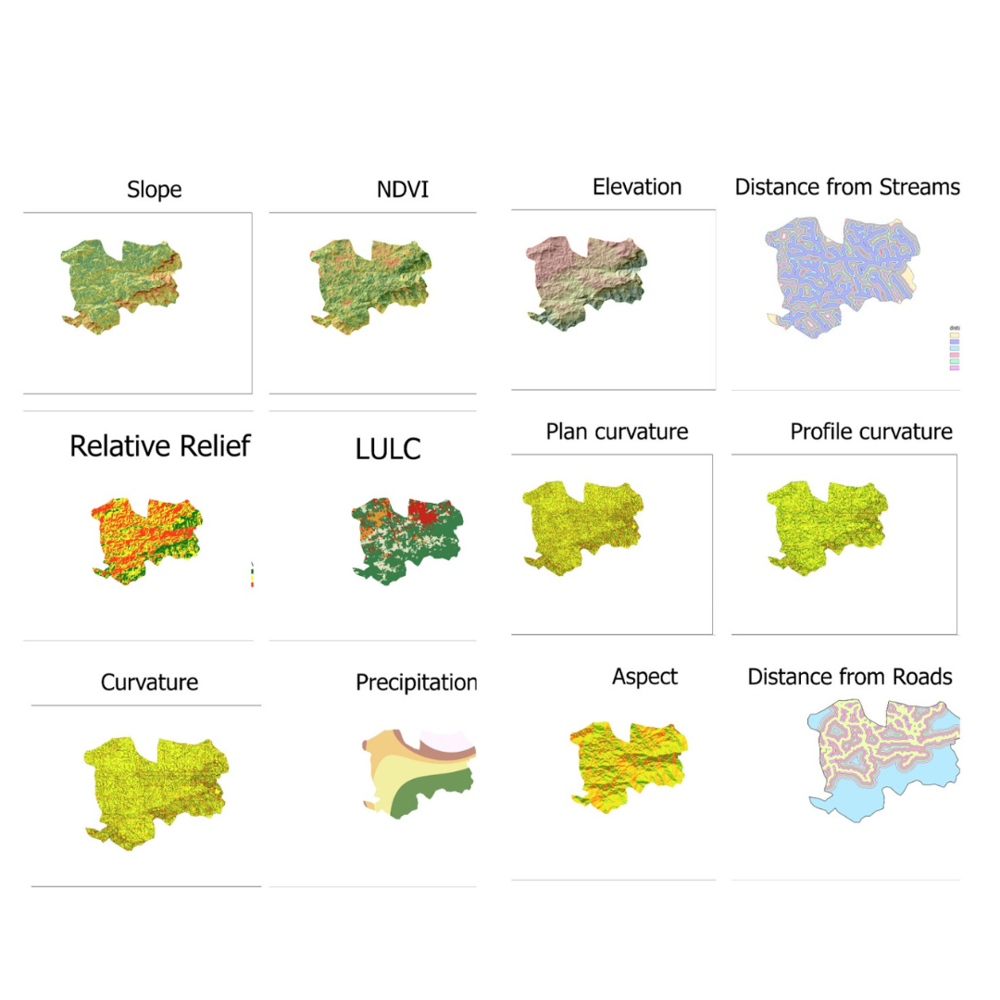
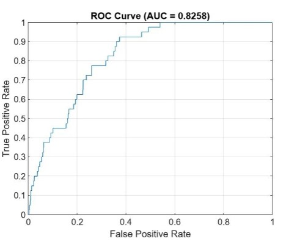

# Landslide Susceptibility Mapping Using Neural Networks

## Project Overview
As part of my coursework in geospatial analysis and machine learning, I developed a deep learning model to predict landslide susceptibility using various geographical and environmental factors. This project combines remote sensing data, GIS techniques, and neural networks to create a comprehensive landslide risk assessment tool.

## Input Features
The model uses 12 different geospatial features stored as GeoTIFF files:
1. Aspect (terrain orientation)
2. Curvature (general terrain curvature)
3. Distance from roads
4. Distance from streams
5. Elevation
6. Land use/land cover (LULC)
7. NDVI (Normalized Difference Vegetation Index)
8. Plan curvature
9. Precipitation
10. Profile curvature
11. Relative relief
12. Slope

Each feature is automatically preprocessed by:
- Resampling to match the reference landslide inventory dimensions
- Normalizing values to the [0,1] range
- Handling missing (NaN) values
- Preserving coordinate reference system (CRS) information

## Model Architecture
The neural network implementation uses MATLAB's Deep Learning Toolbox with the following specifications:

### Network Structure
- Input layer: 12 nodes (one for each feature)
- Hidden layers: [64, 32, 16] nodes (cascading architecture)
- Output layer: 1 node (landslide probability)

### Configuration
- Activation functions:
  - Hidden layers: Hyperbolic tangent sigmoid (tansig)
  - Output layer: Logistic sigmoid (logsig)
- Loss function: Cross-entropy
- Training algorithm: Scaled conjugate gradient (trainscg)
- Training parameters:
  - Maximum epochs: 100
  - Minimum gradient: 1e-6
  - Maximum validation failures: 20

### Data Split
- Training: 70%
- Validation: 15%
- Testing: 15%

## Results
The model achieved the following performance metrics on the test set:
- 

## Output Files
1. `landslide_susceptibility_map.tif`: GeoTIFF file containing the predicted susceptibility values
2. `landslide_model.mat`: Saved MATLAB model file containing:
   - Trained neural network
   - Training record
   - Model architecture
   - Performance metrics

## Technical Implementation
- The code supports parallel processing and GPU acceleration if available
- Maintains geospatial integrity by preserving CRS information
- Includes automated data preprocessing and validation
- Generates visualization of model performance through ROC curves

## Notes for Future Users
1. Ensure all input GeoTIFF files are in the same coordinate reference system
2. Input files should be placed in the same directory as the script
3. The code automatically handles resampling of input features to match the reference landslide inventory
4. GPU support can significantly speed up training for large datasets

## Dependencies
- MATLAB R2019b or later
- Deep Learning Toolbox
- Mapping Toolbox

